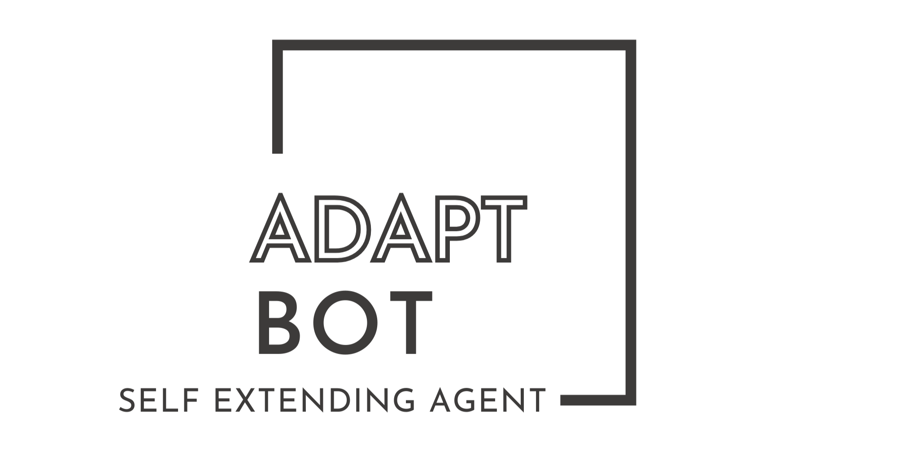
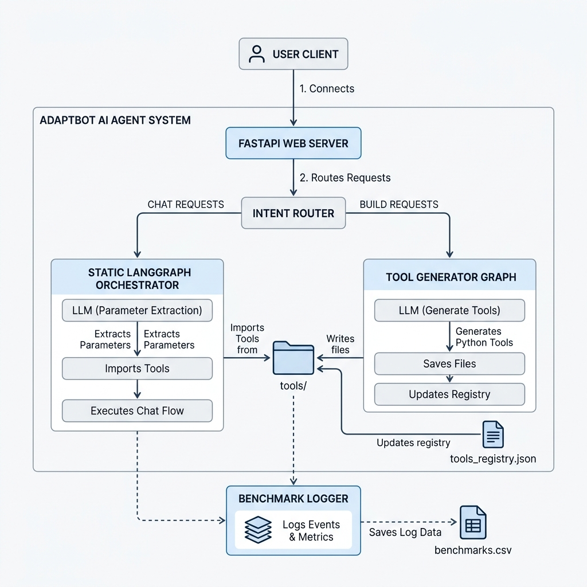

<p align="center">
  
</p>

# AdaptBot

Dynamic self-extending AI agent with static LangGraph orchestration.
# AdaptBot

AdaptBot is a dynamic, self-extending AI agent system that can answer general questions, route tool-based requests through a static LangGraph workflow, and generate, modify, or delete Python tools at runtime.

Unlike traditional agent systems where tools are predefined and tightly coupled to the execution graph, AdaptBot keeps the orchestration layer fixed while allowing its capabilities to evolve dynamically. New tools are generated as standalone Python modules, registered automatically, and loaded at runtime without restarting the application or recompiling the graph.

> [!TIP]
> **Key Design Principles & Advantages:**
> *   **✓ Graph compiled once:** The LangGraph is initialized only once on startup.
> *   **✓ No graph rewiring:** Adding capabilities never changes the graph architecture.
> *   **✓ No server restart:** Changes apply live without server downtime.
> *   **✓ Runtime tool discovery:** Instantly reads available tools from the registry.
> *   **✓ Dynamic module loading:** Uses on-demand Python imports/reloads.

### Comparison of Approaches

| Metric / Action | Approach A: Traditional Agent | Approach B: AdaptBot |
| :--- | :--- | :--- |
| **Add/Modify/Delete Tool** | Manual code writing | Automated on-the-fly generation |
| **Application Lifecycle** | Requires app/server restart | Continues running seamlessly (zero downtime) |
| **Graph Management** | Requires rewiring nodes and recompiling | Stays compiled once (runtime module loading) |
| **Discovery Mechanism** | Hardcoded bindings | Dynamic file-based registry lookup |

---

## Key Features

*   **Dynamic Tool Lifecycle:** Create, modify, and delete tools on the fly.
*   **Static LangGraph Orchestrator:** Dynamic capability resolution at runtime without graph recompilation.
*   **Automatic Discovery:** Uses a JSON registry-based system to register and load tools dynamically.
*   **Universal Structured Parameter Extraction:** Automatic derivation of complex inputs from conversation history.
*   **FastAPI & Modern UI:** A responsive, light-mode chat interface with interactive prompt cards.
*   **Integrated Performance Benchmarks:** Dynamically logs execution latency, creation times, and success rates.

---

## Architecture Overview



This project follows the architecture detailed in the **[architecture.md](architecture.md)** file.

1.  **Intent Classifier:** Separates incoming requests into `BUILD` (tool generation/management) or `CHAT` (general assistant or tool execution).
2.  **Tool Management Graph (`tool_generator.py`):** Handles writing, modifying, and deleting tool code files in the `tools/` directory.
3.  **Static Execution Graph (`graph.py`):** Routes chat queries through a stable graph containing a custom classifier, a general LLM response node, and a universal tool execution node.
4.  **Universal Parameter Extractor:** Dynamically parses conversational history to extract structured properties based on the tool's `ToolInputSchema`.

---

## Repository Structure

```text
AdaptBot/
|- app.py                    # FastAPI web server & routes
|- bot.py                    # CLI chat interface
|- graph.py                  # Static LangGraph execution workflow
|- tool_generator.py        # Tool builder workflow (CREATE, MODIFY, DELETE)
|- benchmark_logger.py       # Thread-safe CSV metrics logging helper
|- benchmarks.csv            # Autogenerated log containing performance stats
|- run_benchmark.py          # Script to run comprehensive benchmark suites
|- tools_registry.json       # JSON file listing registered tools
|- architecture.md           # System architecture design document
|- tools/                    # Subdirectory containing generated Python tools
|- templates/
|  |- index.html             # Light-mode web chat interface
```

---

## Tech Stack

*   Python (>= 3.10)
*   FastAPI & Uvicorn
*   Jinja2 Templates
*   LangGraph & LangChain
*   Pydantic
*   `langchain-openai` & `python-dotenv`
*   Groq API endpoint (`openai/gpt-oss-20b`)

---

## Setup & Installation

This project is configured to use [uv](https://github.com/astral-sh/uv) for fast package management, but standard pip is also supported.

### 1. Clone the Repository
```bash
git clone <your-repo-url>
cd AdaptBot
```

### 2. Configure Environment Variables
Create a `.env` file in the root directory:
```env
GROQ_API_KEY=your_groq_api_key_here
```

### 3. Install Dependencies & Start Web Server

#### Using `uv` (Recommended)
```bash
# Start the web server (it installs dependencies automatically)
uv run uvicorn app:app --reload
```

#### Using standard `pip`
```bash
# Create and activate virtual environment
python -m venv .venv
# On Windows:
.venv\Scripts\activate
# On Linux/macOS:
source .venv/bin/activate

# Install dependencies
pip install fastapi uvicorn jinja2 langchain langchain-core langchain-openai langgraph pydantic python-dotenv requests pytz

# Start the server
uvicorn app:app --reload
```

Once running, open your browser and navigate to:
```text
http://127.0.0.1:8000
```

---

## Running Benchmarks

We log all user interactions, latencies, and tool execution statuses into `benchmarks.csv`. You can run a mock benchmark suite to populate and inspect these metrics:

```bash
python run_benchmark.py
```
This runs a 9-step transaction testing general chat, tool creation, parameter extraction, tool modification, execution, and tool deletion.

### Local Benchmark Summary (Calculated from benchmarks.csv)

| Operation / Metric | Success / Total | Success Rate | Average Latency |
| :--- | :--- | :--- | :--- |
| **Intent Classification** | 41 / 44 | 93.2% | ~2.5s |
| **Tool Creation** | 9 / 11 | 81.8% | ~6.0s |
| **Tool Modification** | 4 / 5 | 80.0% | ~7.9s |
| **Tool Deletion** | 4 / 4 | 100.0% | ~2.5s |
| **Parameter Extraction** | 5 / 5 | 100.0% | ~8.8s (included in execution) |
| **Tool Execution** | 5 / 5 | 100.0% | ~8.8s |

*Note: Latency calculations exclude network error states (such as temporary 401/400 API limits or invalid keys).*