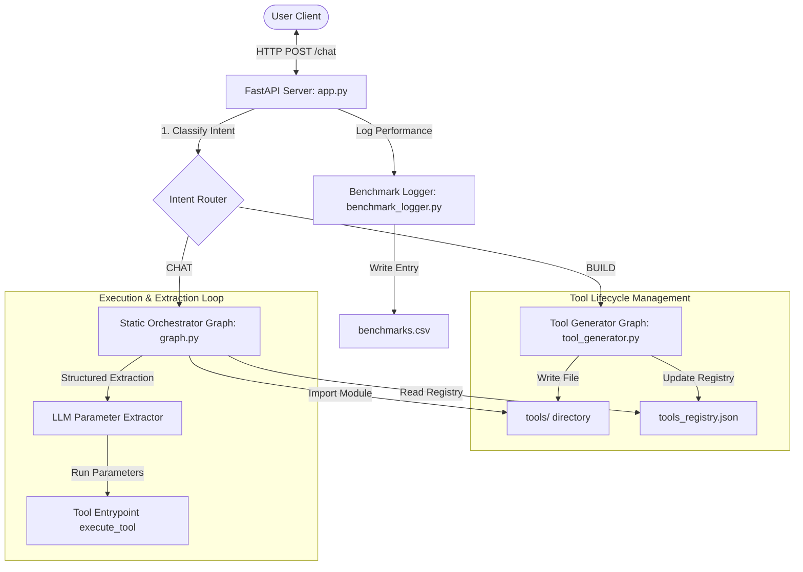

# AdaptBot Architecture Design Document

AdaptBot is a self-extending AI agent system that dynamically expands its capabilities at runtime. It routes user queries through a permanently compiled LangGraph workflow. If a requested capability or tool does not exist, AdaptBot generates a new Python tool file, registers it, and runs it on the fly. Performance and reliability metrics are captured thread-safely into a CSV logger.

> [!TIP]
> **Key Design Principles & Advantages:**
> *   **✓ Graph compiled once:** The LangGraph is initialized only once on startup.
> *   **✓ No graph rewiring:** Adding capabilities never changes the graph architecture.
> *   **✓ No server restart:** Changes apply live without server downtime.
> *   **✓ Runtime tool discovery:** Instantly reads available tools from the registry.
> *   **✓ Dynamic module loading:** Uses on-demand Python imports/reloads.

---

## 1. System Topology & Component Layout

---

## 2. Core Components

### A. Presentation & Web Routing (`app.py`)
*   **FastAPI & Jinja2 Templates:** Serves a lightweight, clean, light-mode chat interface (`templates/index.html`) using standard fetch calls.
*   **Intent Router:** Uses the primary LLM (`openai/gpt-oss-20b` via Groq) to inspect raw user input and classify it as `BUILD` (wants a tool created/modified/deleted) or `CHAT` (wants an answer/execution).
*   **Latency Measurement Wrapper:** Starts a timer on request entry and completes it on response return. Measures overall response latencies and logs them.

### B. Static Orchestrator Graph (`graph.py`)
This is a LangGraph workflow compiled exactly once on startup. It has four stable nodes that never require recompilation:
1.  **`classifier_node`:** Inspects the query against `tools_registry.json` and classifies it into `general`, `need_tool`, or a specific tool name (e.g. `weather_forecast`).
2.  **`general_node`:** Responds directly to general knowledge questions without tools.
3.  **`execute_tool_node`:** Dynamically resolves and imports the module from the `tools/` directory.
    *   **Universal Parameter Extractor:** If the tool script declares a Pydantic `ToolInputSchema` with parameters, the node uses LLM structured output to extract precise arguments from raw user conversational history.
    *   **Safeguarded Invocation:** Wraps parameter extraction and execution in independent try-except blocks, recording success states.
4.  **`synthesizer_node`:** Rewrites raw tool outputs into friendly, conversational responses.

### C. Tool Generator Graph (`tool_generator.py`)
A secondary LangGraph workflow tasked with tool lifecycle changes:
*   **`decision_tool`:** Determines if the build request is a `CREATE`, `MODIFY`, or `DELETE` operation.
*   **`create_tool` / `modify_tool`:** Prompts the LLM to write isolated Python files to the `tools/` directory. The LLM must output clean code conforming to the universal input/execution schema.
*   **`delete_tool`:** Removes the file and updates the registry.

### D. Benchmarking and Logging (`benchmark_logger.py`)
Provides thread-safe file handling to write logs to `benchmarks.csv`. Captured fields include:
*   `timestamp`: When the transaction occurred.
*   `query`: The user's prompt.
*   `intent`: `BUILD` or `CHAT`.
*   `category`: Path/Tool executed.
*   `tool_generation_time_sec`: Time taken to compile a tool.
*   `parameter_extraction_success`: `True` / `False` / `N/A` indicating if the extraction succeeded.
*   `tool_execution_success`: `True` / `False` / `N/A` indicating if the tool completed without crash.
*   `end_to_end_latency_sec`: Complete request processing duration.
*   `error_message`: Stack trace or error string if any node errored.

---

## 3. Data Flow Scenarios

### Scenario A: Standard Chat Query (Using an Existing Tool)
1.  User enters: *"What is the weather in New York?"*
2.  `app.py` receives request -> starts timer.
3.  `app.py` classifies intent as `CHAT`.
4.  `graph.py` `classifier_node` runs. It reads `tools_registry.json` (contains `weather_forecast`) and matches the query to the `weather_forecast` tool.
5.  `execute_tool_node` dynamically imports `tools/weather_forecast.py`.
6.  It looks at the `ToolInputSchema` (requires `city: str`), calls the LLM with structured output to extract `city="New York"`, and sets `parameter_extraction_success="True"`.
7.  Runs `execute_tool(city="New York")`, receives response, and sets `tool_execution_success="True"`.
8.  `synthesizer_node` formats the raw weather data into a friendly reply.
9.  `app.py` logs the successful execution to `benchmarks.csv` and returns the reply.

### Scenario B: Dynamic Tool Generation Flow
1.  User enters: *"Convert 100 USD to EUR"*
2.  If the registry does not contain a currency tool:
    *   `graph.py` `classifier_node` routes it as `need_tool`.
    *   `app.py` returns `need_tool: True` with a prompt asking the user if they'd like to build the tool.
3.  User clicks **"Create Tool"** in the browser.
4.  Browser posts a request to build the tool.
5.  `app.py` classifies the request as `BUILD` and pipes it to `tool_generator.py`.
6.  `create_tool` writes `tools/currency_converter.py` and registers it in `tools_registry.json`.
7.  `app.py` logs `tool_generation_time_sec`.
8.  The UI automatically resubmits the original query (*"Convert 100 USD to EUR"*), which now successfully executes using Scenario A.
